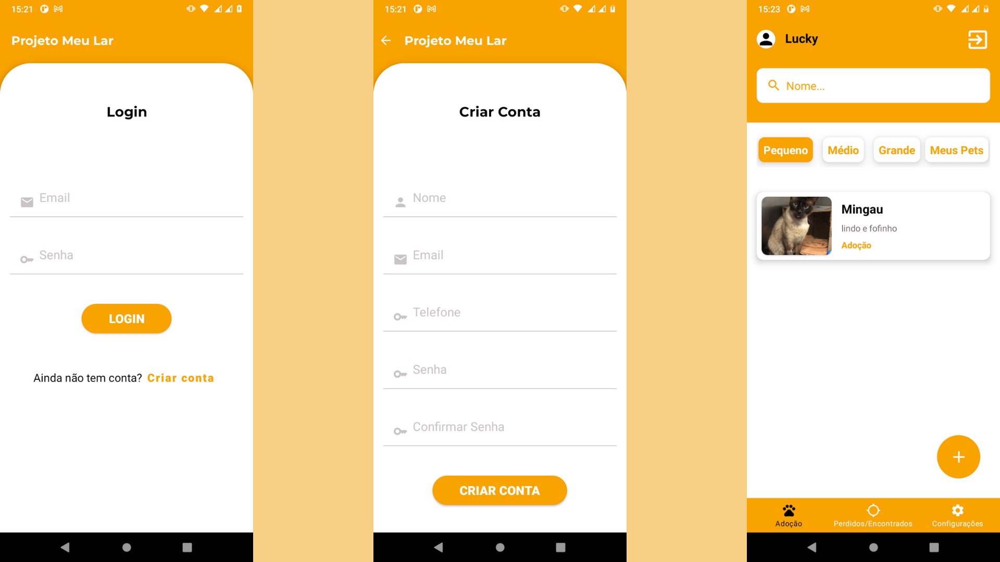
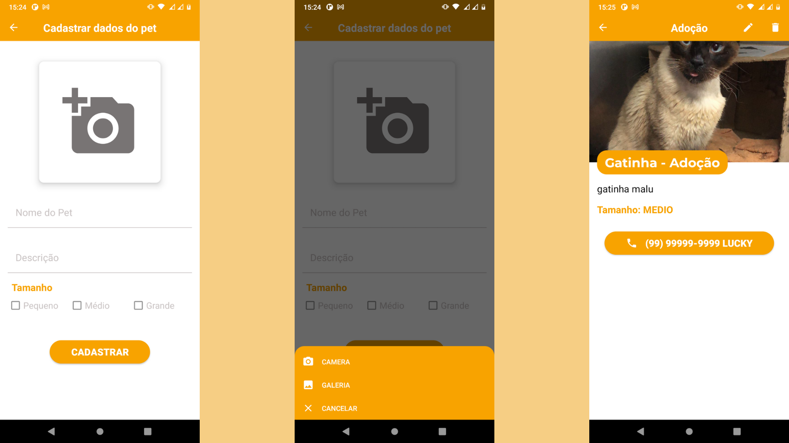
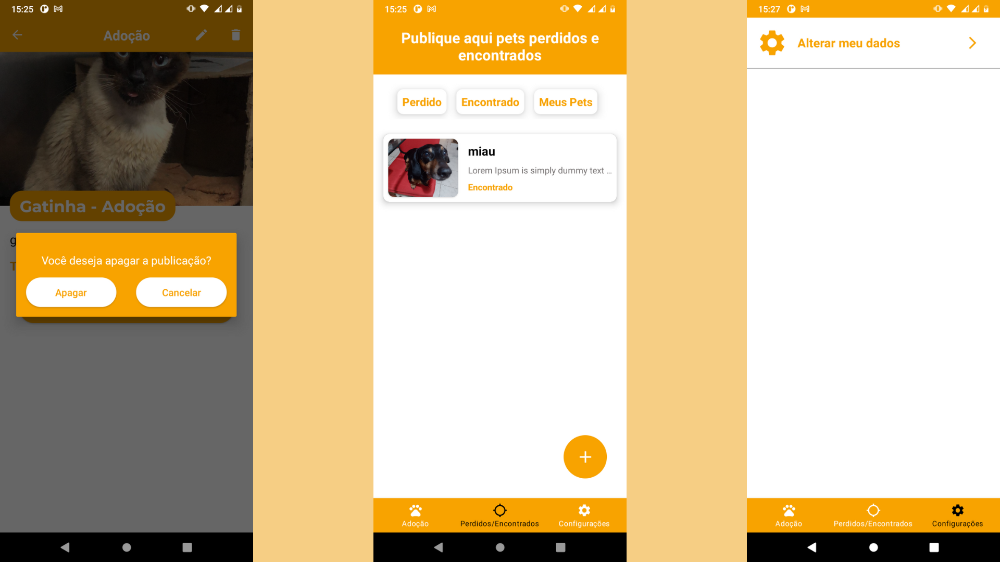
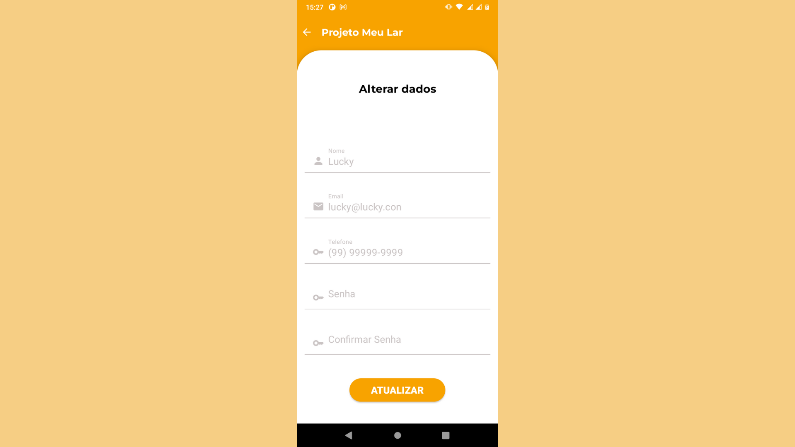

# Projeto Meu Lar

## Sobre o projeto
Projeto criado com a ideia de ser um app para facilitar a adoção de pets, recuperar pets perdidos e publicar sobre pets encontrados, tudo isso atravês de postagens feitas no app, onde disponibiliza foto do pet, dados de contato com o dono do post e dados do pet.

## Tecnologias Utilizadas
### Back end
- Spring Boot
- MySql
- Docker
- Firebase Storage

### Mobile
- Kotlin(android)
- Retrofit

# Layout Mobile
### Login / Criar Conta / Home

### Cadastrar Post / Inserir Imagem / Detalhes do post

### Apagar Post / Pets perdidos e encontrados / Configurações

### Atualizar dados



## Técnicas e tecnologias utilizadas

### Spring Boot

A aplicação foi desenvolvida com o Spring Boot utilizando Java e foram utilizadas as seguintes técnicas:

- `Controllers`: mapear os endpoints
- `Services`: realizar as ações esperadas pelo controller
- `Repositories`: oferecer e realizar os comportamentos de persistência de banco de dados
- `DTO`: padrão para indicar quais informações devem ser enviada/recebidas via requisição
- `JPA` com `Hibernate`: solução para se comunicar com o banco de dados
- `Mysql`:  sistema de gerenciamento de banco de dados, que utiliza a linguagem SQL como interface.
- `Security`: tratamento e analise do Token

Bibliotecas do Spring Framework que foram utilizadas:

- `devtools`: ferramenta para agilizar o processo de desenvolvimento sem reiniciar a aplicação para atualizar
- `starter-web`: suporte para aplicação web em geral
- `starter-data-jpa`: suporte para abstrair a implementação de repositórios e reutilizar comportamentos de CRUD com base na configuração da JPA
- `starter-security`: sistemas de autenticação, autorização e proteção contra diferentes tipos de vulnerabilidades de aplicações web,também disponibiliza algoritmos de criptografias
- `starter-validation`: caso tenha algum problema com a nossa requisição, retorna o erro da requisição
## Endpoints para api
### Usuario
```bash
#Salvar usuario

Método: Post

endpoint: /api/usuario/criar
#Request
{
    "email":"",
    "senha":"",
    "telefone":"",
    "nome":""
}

#Response
Status 201 - CREATED
```

```bash
#Login usuario

Método: Post

endpoint: /api/usuario/login

#Request
{
    "email":"",
    "senha":""
}

#Response
{
    "token": "",
    "idUser": "",
    "nome": ""
}
Status 200 - OK
```

```bash
#Get dados do usuario
Role: USER

Método: GET

endpoint: usuario/get_user/{idUser}

#header
"Authorization:" "Bearer Token"

#Response
{
    "id":"",
    "nome":""
    "email":"",
    "senha":"",
    "telefone":"",
    "pets":[]

}
Status 200 - OK
```

```bash
#Update usuario
Role: USER

Método: Put

endpoint: /api/usuario/atualizar

#header
"Authorization:" "Bearer Token"

#Request
{
    "id":"",
    "email":"",
    "senha":"",
    "telefone":"",
    "nome":""
}

#Response
Status 200 - OK
```

```bash
#Deletar usuario
Role: ADMIN

Método: Delete

endpoint: /api/usuario/deletar/{idUser}

#header
"Authorization:" "Bearer Token"

#Response
Status 200 - OK
```

### Posts
```bash
#Salvar post
Role: USER

Método: Post

endpoint: /api/pet/cadastrar_pet/{idUser}

#Header
"Authorization:" "Bearer Token"

#Request
{
    "id":"",
    "nome": "",
    "descricao": "",
    "status": "ENCONTRADO ou ADOTAR ou PERDIDO",
    "imagem":"",
    "tamanho": "PEQUENO ou MEDIO ou GRANDE"
}

#Response
Status 201 - CREATED
```

```bash
#Ver todos os posts
Role: USER

Método: GET

endpoint: /api/pet/todos_pets

#header
"Authorization:" "Bearer Token"

#Response
{
    "pets":[]
}

Status 200 - OK
```

```bash
#Ver todos os posts de pets perdidos e encontrados
Role: USER

Método: GET

endpoint: /api/pet/todos_pets_perdidos_encontrados

#header
"Authorization:" "Bearer Token"

#Response
{
    "pets":[]
}

Status 200 - OK
```

```bash
#Ver todos os meus posts
Role: USER

Método: GET

endpoint: /api/pet/todos_meus_pets/{idUser}

#header
"Authorization:" "Bearer Token"

#Response
{
    "pets":[]
}

Status 200 - OK
```

```bash
#Ver todos os posts de pets de tamanho pequenos
Role: USER

Método: GET

endpoint: /api/pet/todos_pets_pequeno

#header
"Authorization:" "Bearer Token"

#Response
{
    "pets":[]
}

Status 200 - OK
```

```bash
#Ver todos os posts de pets de tamanho médio
Role: USER

Método: GET

endpoint: /api/pet/todos_pets_medio

#header
"Authorization:" "Bearer Token"

#Response
{
    "pets":[]
}

Status 200 - OK
```

```bash
#Ver todos os posts de pets de tamanho grande
Role: USER

Método: GET

endpoint: /api/pet/todos_pets_grande

#header
"Authorization:" "Bearer Token"

#Response
{
    "pets":[]
}

Status 200 - OK
```

```bash
#Ver todos os posts de pets em adoção
Role: USER

Método: GET

endpoint: /api/pet/todos_pets_adotar

#header
"Authorization:" "Bearer Token"

#Response
{
    "pets":[]
}

Status 200 - OK
```

```bash
#Ver todos os posts de pets encontrados
Role: USER

Método: GET

endpoint: /api/pet/todos_pets_encontrado

#header
"Authorization:" "Bearer Token"

#Response
{
    "pets":[]
}

Status 200 - OK
```

```bash
#Ver todos os posts de pets perdidos
Role: USER

Método: GET

endpoint: /api/pet/todos_pets_perdido

#header
"Authorization:" "Bearer Token"

#Response
{
    "pets":[]
}

Status 200 - OK
```

```bash
#Atualizar posts de pet
Role: USER

Método: PUT

endpoint: /api/pet/atualizar_pet/{idPet}/{idUser}

#header
"Authorization:" "Bearer Token"

#Response
{
    "nome": "",
    "descricao": "",
    "status": "ENCONTRADO ou ADOTAR ou PERDIDO",
    "imagem":"",
    "tamanho": "PEQUENO ou MEDIO ou GRANDE"
}

Status 200 - OK
```

```bash
#Apagar posts de pet
Role: USER

Método: DELETE

endpoint: /api/pet/apagar_pet/{idPet}/{idUser}

#header
"Authorization:" "Bearer Token"

#Response

Status 204 - NO CONTENT
```

